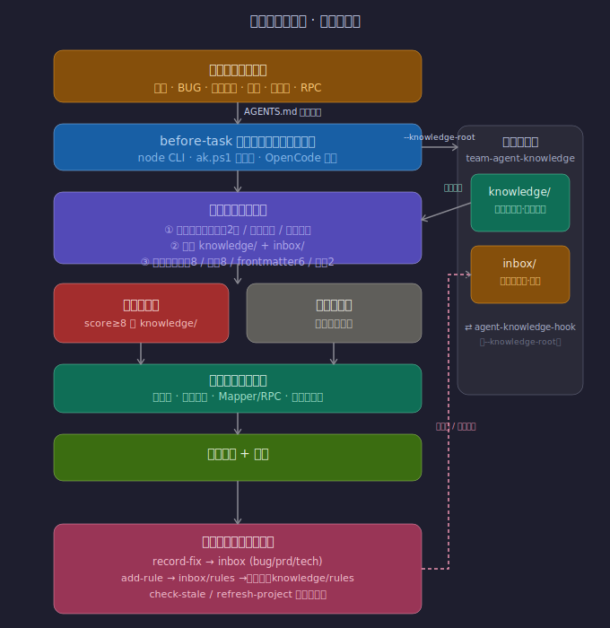

# Agent Knowledge Hook

面向 Codex、Claude、OpenCode 等 AI 编程工具的团队知识库命令式钩子。

它解决的问题是：AI 在分析需求、BUG 或技术方案时，不能只靠临时代码搜索，还需要先读取团队已经确认过的业务知识、服务边界、历史坑和人工纠错记录，避免反复踩同一个问题。

## 快速使用

从仓库根目录运行：

```powershell
powershell -ExecutionPolicy Bypass -File .\agent-knowledge\bin\ak.ps1 task "修复 queryEntityGraph 实体图谱 ownerId 为空"
```

如果希望在当前 PowerShell 会话里直接使用 `ak`：

```powershell
Set-Alias ak <workspace-root>\agent-knowledge-hook\agent-knowledge\bin\ak.ps1
ak help
ak help check
ak check poseidon
ak refresh poseidon "同步本次需求变化"
ak bug "学习报告统计口径错误" --target knowledge/rules/learning-report.md
ak resolve inbox/fixes/<纠错文件>.md
ak rule "聚合接口实体集合和映射来源必须一致"
ak adapters --check
ak doctor --json
```

底层 CLI 也可以直接调用：

```powershell
node agent-knowledge/bin/agent-knowledge.js before-task "修复 queryEntityGraph 实体图谱 ownerId 为空"
```

Windows PowerShell 包装器：

```powershell
powershell -ExecutionPolicy Bypass -File .\agent-knowledge\bin\agent-knowledge.ps1 before-task "修复 queryEntityGraph 实体图谱 ownerId 为空"
```

搜索知识库：

```powershell
node agent-knowledge/bin/agent-knowledge.js search "RPC 本地依赖"
```

完整命令、纠偏关闭、恢复和锁诊断说明见 [agent-knowledge/README.md](agent-knowledge/README.md)；待确认材料的处理边界见 [agent-knowledge/inbox/README.md](agent-knowledge/inbox/README.md)。

真实团队知识建议放在私有知识库仓库中，再用 `--knowledge-root` 指向它：

```powershell
node agent-knowledge/bin/agent-knowledge.js before-task "分析 graph-service 实体归属" --knowledge-root <workspace-root>\team-agent-knowledge
```

也可以通过环境变量固定知识库位置：

```powershell
$env:AGENT_KNOWLEDGE_ROOT = "<workspace-root>\team-agent-knowledge"
node agent-knowledge/bin/agent-knowledge.js search "graph-service 项目职责"
```

## 命令使用姿势

以下命令都可以用 `node agent-knowledge/bin/agent-knowledge.js ...` 调用；如果已把包装器加入 PATH，也可以直接使用 `agent-knowledge ...`。

日常使用优先使用短命令 `ak`：

以下结构化命令区块由命令契约自动生成，请勿手工修改。

<!-- BEGIN GENERATED: AK_COMMAND_TABLE -->
| 短命令 | 作用 |
| --- | --- |
| `ak task <任务描述>` | 任务开始前检索相关知识 |
| `ak search <关键词>` | 主动搜索知识库 |
| `ak projects` | 列出知识库项目索引中的项目 |
| `ak check <项目名>` | 检查项目知识文件是否落后于项目当前 HEAD |
| `ak refresh <项目名> [说明]` | 刷新项目知识文件的元数据和刷新记录 |
| `ak bug <标题> [--target <文件>]` | 记录 BUG 纠错到 inbox |
| `ak prd <标题> [--target <文件>]` | 记录 PRD 纠偏到 inbox |
| `ak tech <标题> [--target <文件>]` | 记录技术方案纠偏到 inbox |
| `ak rule <规则标题> [--confirmed]` | 新增规则草稿或确认规则 |
| `ak promote <inbox文件>` | 晋升普通草稿或不带 target 的独立 fix |
| `ak resolve <文件> [--confirm-legacy]` | 确认 targeted fix 已合入目标并归档审计 |
| `ak pending` | 列出 inbox 下待确认条目 |
| `ak adapters [--check]` | 同步或只读检查 OpenCode 命令适配器 |
| `ak doctor [--json]` | 检查知识库结构、引用、证据和适配器漂移 |
| `ak raw <原始参数>` | 透传到底层 agent-knowledge CLI |
<!-- END GENERATED: AK_COMMAND_TABLE -->

每条短命令都可以直接查看详细说明：

```powershell
ak help check
ak help refresh
ak bug --help
```

<!-- BEGIN GENERATED: CLI_COMMAND_TABLE -->
| 命令 | 什么时候用 | 是否写文件 | JSON 输出 |
| --- | --- | --- | --- |
| `before-task <text>` | 输出任务前知识提示 | 否 | 支持 |
| `search <text>` | 搜索知识库 | 否 | 支持 |
| `add-rule <title> [--confirmed]` | 新增规则草稿或确认规则 | 是 | 不支持 |
| `record-fix --type <bug\|prd\|tech> --title <title> [--target <path>]` | 记录修复经验 | 是 | 不支持 |
| `check-stale --project-root <path> --knowledge-file <path> [--deep]` | 检查知识条目是否落后于项目 HEAD（--deep 比对 evidence_files） | 否 | 支持 |
| `refresh-project --project-root <path> --knowledge-file <path> [--summary <text>]` | 刷新项目知识元数据 | 是 | 不支持 |
| `resolve-fix --file <path> [--confirm-legacy]` | 校验 targeted fix 已合并并归档审计工件 | 是 | 不支持 |
| `promote --file <path>` | 将 inbox 待确认条目晋升到 knowledge（status 改为 confirmed） | 是 | 不支持 |
| `list-pending` | 列出 inbox 下所有待确认条目 | 否 | 不支持 |
| `sync-adapters [--check]` | 同步或检查 OpenCode 命令适配器 | 视参数而定 | 不支持 |
| `doctor [--json]` | 只读检查知识库结构、引用、证据与适配器漂移 | 否 | 支持 |
| `sync-command-docs [--check] --repository-root <path>` | 同步或检查生成的命令文档 | 视参数而定 | 不支持 |
<!-- END GENERATED: CLI_COMMAND_TABLE -->

命令是否支持 `--json` 由统一命令契约维护，以本页上方生成表格的“JSON 输出”列为准；支持时会输出结构化结果，便于自动化管线消费。

任务开始前读取知识：

```powershell
node agent-knowledge/bin/agent-knowledge.js before-task "修复 queryEntityGraph 实体图谱 ownerId 为空" --knowledge-root <workspace-root>\team-agent-knowledge
```

按关键词搜索知识：

```powershell
node agent-knowledge/bin/agent-knowledge.js search "聚合接口 数据源一致" --knowledge-root <workspace-root>\team-agent-knowledge
```

新增待确认规则草稿：

```powershell
node agent-knowledge/bin/agent-knowledge.js add-rule "聚合接口实体集合和映射来源必须一致" --knowledge-root <workspace-root>\team-agent-knowledge
```

新增已确认规则：

```powershell
node agent-knowledge/bin/agent-knowledge.js add-rule "禁止在循环中逐条远程查询" --confirmed --knowledge-root <workspace-root>\team-agent-knowledge
```

记录一次纠错。`--type bug` 写入 `inbox/fixes/`，`--type prd` 写入 `inbox/prd-corrections/`，`--type tech` 写入 `inbox/tech-solution-corrections/`。如果被纠正对象还是 `inbox/` 中的未确认草稿，直接修改原草稿，不要额外创建 fix；只有目标已经是 `knowledge/` 下的正式知识时才传 `--target`：

```powershell
node agent-knowledge/bin/agent-knowledge.js record-fix --type bug --title "实体图谱 ownerId 为空" --target knowledge/rules/entity-graph.md --knowledge-root <workspace-root>\team-agent-knowledge
```

带 `--target` 的 targeted fix 会记录 `fix_id` 和目标基线 `target_hash`。它不能通过 `promote` 生成第二份正式知识；应先基于证据修改并完整审核目标正文，再关闭纠偏。没有对应正式知识、需要作为独立长期知识候选保留时，可以不传 `--target`，这类独立 fix 才能在人工确认后使用 `promote`。

关闭已经被目标正式知识吸收的 targeted fix：

```powershell
node agent-knowledge/bin/agent-knowledge.js resolve-fix --file inbox/fixes/<纠偏文件>.md --knowledge-root <workspace-root>\team-agent-knowledge
```

`resolve-fix` 只校验目标仍为 `confirmed` 且当前哈希不同于记录基线，不会自动修改或语义合并目标。哈希变化不能替代人工审核。旧版 targeted fix 缺少 `target_hash` 时，只有人工已经确认目标吸收纠偏后才能显式传 `--confirm-legacy`。成功后生成 `archive/source-survivors/`、`archive/resolved-sources/` 和 `archive/resolved/` 审计工件；中断恢复状态保存在 `work/`，发生冲突时应保留现场并按同一 source 路径重试。

检查知识文件是否落后于项目当前 HEAD：

```powershell
node agent-knowledge/bin/agent-knowledge.js check-stale --project-root <workspace-root>\reasearch-hub --knowledge-file knowledge/domain/project-reasearch-hub.md --knowledge-root <workspace-root>\team-agent-knowledge
```

`check-stale` 只读取知识文件 frontmatter 里的 `last_scanned_commit` 并对比项目当前 `git rev-parse HEAD`，不会改写知识库。

刷新项目知识文件的元数据：

```powershell
node agent-knowledge/bin/agent-knowledge.js refresh-project --project-root <workspace-root>\reasearch-hub --knowledge-file knowledge/domain/project-reasearch-hub.md --summary "同步 Facade 和模块结构变化" --knowledge-root <workspace-root>\team-agent-knowledge
```

`refresh-project` 会更新 `updated`、`project_root`、`last_scanned_commit`，并追加“刷新记录”。它不会自动重写项目说明正文；正文里的业务边界、接口关系和证据链仍需要先由 Codex 或人工基于当前代码确认。

## 推荐工作流

1. 任务开始：运行 `before-task`，先读输出里的必须阅读项。
2. 涉及某个项目说明：运行 `check-stale` 判断知识文件是否落后于项目 HEAD。
3. 如果过期：让 Codex 或人工基于当前代码更新知识文件正文。
4. 正文确认后：运行 `refresh-project` 更新 `last_scanned_commit` 和刷新记录。
5. 开发过程中被纠正：未确认草稿直接修改原文件；正式知识创建带 `--target` 的 targeted fix；独立结论创建不带 `target` 的 fix。
6. 关闭 targeted fix：先修改并完整审核目标正式知识，再执行 `resolve-fix`；不要对它执行 `promote`。
7. 晋升独立材料：普通草稿或不带 `target` 的独立 fix 经人工确认后，才执行 `promote`。
8. 发现长期有效规则：先用 `add-rule` 进 `inbox/rules/`，确认后再整理进 `knowledge/rules/`。

## 架构流转图

下图展示了钩子的端到端流转：业务开发场景被 `AGENTS.md` 强制要求先跑 `before-task`；CLI 经关键词提取与评分，从私有知识库（`team-agent-knowledge`）的 `knowledge/`（已确认）与 `inbox/`（待确认）两区返回「必须阅读项」与「可能相关项」；结论仍需回到真实代码验证。普通草稿和独立 fix 经人工确认后可 `promote`，targeted fix 则把纠偏合入原目标并通过 `resolve-fix` 归档审计，避免产生两份正式知识。



## 知识库位置

默认情况下，命令会使用工具仓库内置的 `agent-knowledge/` 目录。真实团队使用时，推荐把知识库分离成私有仓库：

```text
agent-knowledge-hook
= CLI、模板、适配说明、脱敏示例和测试

team-agent-knowledge
= 真实项目说明、服务关系、业务规则、历史坑和纠错记录
```

分离后用 `--knowledge-root <path>` 或 `AGENT_KNOWLEDGE_ROOT` 指向私有知识库根目录。私有知识库根目录下应包含 `knowledge/` 和 `inbox/`；首次关闭 targeted fix 时会按需创建 `archive/` 和 `work/`，它们不参与检索、必须阅读或待确认清单。

## 跨平台入口

Node 入口：

```powershell
node agent-knowledge/bin/agent-knowledge.js before-task "分析学习流程问题"
```

Windows PowerShell 包装器：

```powershell
powershell -ExecutionPolicy Bypass -File .\agent-knowledge\bin\agent-knowledge.ps1 before-task "分析学习流程问题"
```

macOS / Linux Shell 包装器：

```bash
./agent-knowledge/bin/agent-knowledge.sh before-task "分析学习流程问题"
```

短命令包装器当前提供 PowerShell 版本：

```powershell
.\agent-knowledge\bin\ak.ps1 check poseidon
.\agent-knowledge\bin\ak.ps1 refresh poseidon "同步本次需求变化"
.\agent-knowledge\bin\ak.ps1 resolve inbox/fixes/<纠偏文件>.md
.\agent-knowledge\bin\ak.ps1 doctor --json
```

## 项目结构

- `agent-knowledge/`：核心 CLI、模板、知识库和测试。
- `agent-knowledge/knowledge/`：脱敏示例知识；真实团队知识建议放入私有知识库。
- `agent-knowledge/inbox/`：脱敏示例缓冲区；真实纠错记录建议写入私有知识库的 `inbox/`。
- `agent-knowledge/templates/`：知识模板和 OpenCode 命令适配器的唯一模板来源。
- `agent-knowledge/archive/`：`resolve-fix` 按需生成的 survivor、snapshot 和 resolved 审计记录，不参与检索。
- `agent-knowledge/work/`：`resolve-fix` 的锁和中断恢复状态，不参与检索或待确认清单。
- `agent-knowledge/tool-adapters/`：Codex / Claude / OpenCode 接入说明。
- `agent-knowledge/help/`：PowerShell 短命令中文帮助。
- `.opencode/command/`：OpenCode 命令入口。
- `.github/workflows/agent-knowledge-ci.yml`：测试、适配器漂移检查和示例知识库健康检查。
- `docs/superpowers/`：设计文档和实施计划。
- `AGENT.md`：通用 AI 使用规范和知识库钩子入口规则。

## 验证

```powershell
Push-Location agent-knowledge
npm.cmd run test
Pop-Location

node agent-knowledge/bin/agent-knowledge.js sync-adapters --check --repository-root .
node agent-knowledge/bin/agent-knowledge.js doctor --repository-root .
```

GitHub Actions 会在 `push` 和 `pull_request` 时运行同一套测试、命令文档漂移门禁、只读适配器漂移检查和内置示例知识库 `doctor`。当前测试覆盖检索排序、过期检测、JSON 输出、安全写入、纠错生命周期、targeted fix 关闭与恢复、锁诊断、适配器同步、CLI/PowerShell 参数边界、晋升和待确认清单。

Windows PowerShell 最近一次验证结果为全量测试零失败；其中 1 项文件 symlink 拒绝用例因当前权限无法创建测试 symlink 而跳过。命令文档、适配器漂移检查和内置示例知识库 `doctor` 均纳入验证。
